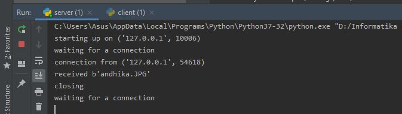

Andhika Yoga Perdana   05111740000101  

## Tugas 1
### Jalankan program server.py di 3 port yang berbeda (31000, 31001, 31002) 
* Bukti
    Saat server berjalan 
    

    Client mengirimkan pesan ke port 31000 
    

    Client mengirimkan pesan ke port 31001 
    

    Client mengirimkan pesan ke port 31002 
    

### Jalankan program client.py untuk konek ke server yang jalan pada poin sebelumnya dan mengirimkan string “JARINGAN TEKNIK INFORPEMROGRAMAN MATIKA” 
* Bukti
    client mengirimkan pesan 
    

    server menerima pesan dari clien 
    
    

### Jalankan program server.py di 3 port yang berbeda di 2 komputer yang berbeda dan jalankan program client.py untuk konek ke server pada poin sebelumnya, kirimkan string yang sama
* Bukti
    server dijalankan di komputer lain (IP : 10.151.253.11 ).  
    client dijalankan di komputer saya dengan IP 10.151.252.209.  
    client mengirimkan string "JARINGAN TEKNIK INFORPEMROGRAMAN MATIKA" 
      Server  
      Client  

### MODIFIKASILAH program client.py dan server.py agar dapat MENTRANSFER file dari client ke server (letakkan program modifikasi di direktori tugas1a)
* Bukti
    client mengirim file ke server 
    

    server menerima file 
    

    bukti file yang dikirimkan 
    

### MODIFIKASILAH program server.py agar dapat mengirimkan MENTRANSFER FILE yang di request oleh client (letakkan program modifikasi di direktori tugas1b) 
* Bukti
    client request file ke server 
    

    server mengirimkan file  
    

    bukti file yang dikirimkan 
    
