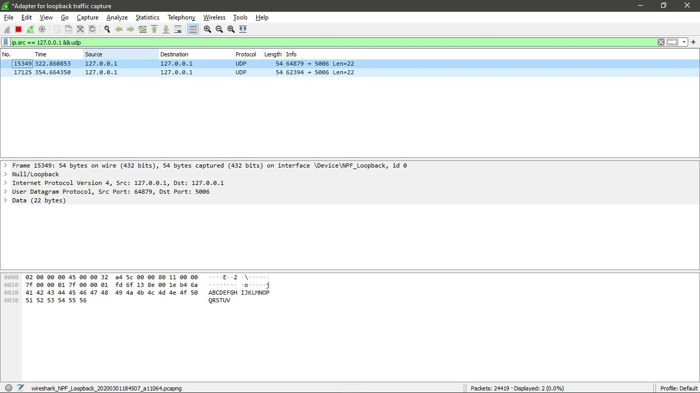
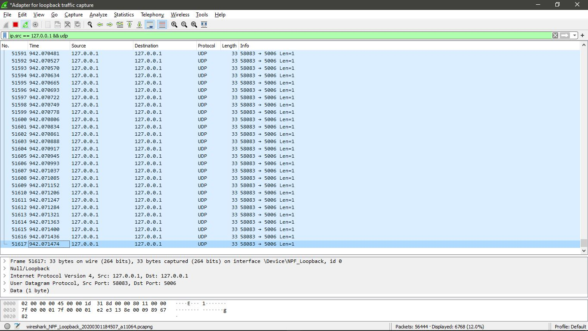
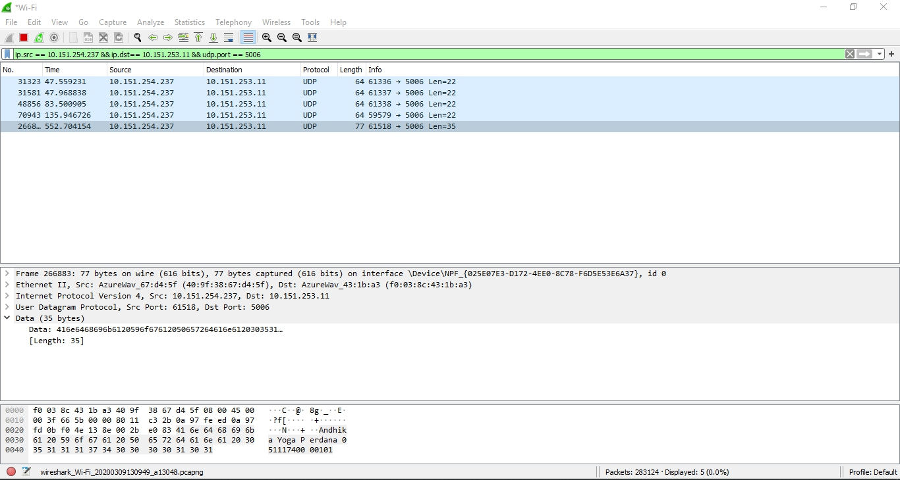
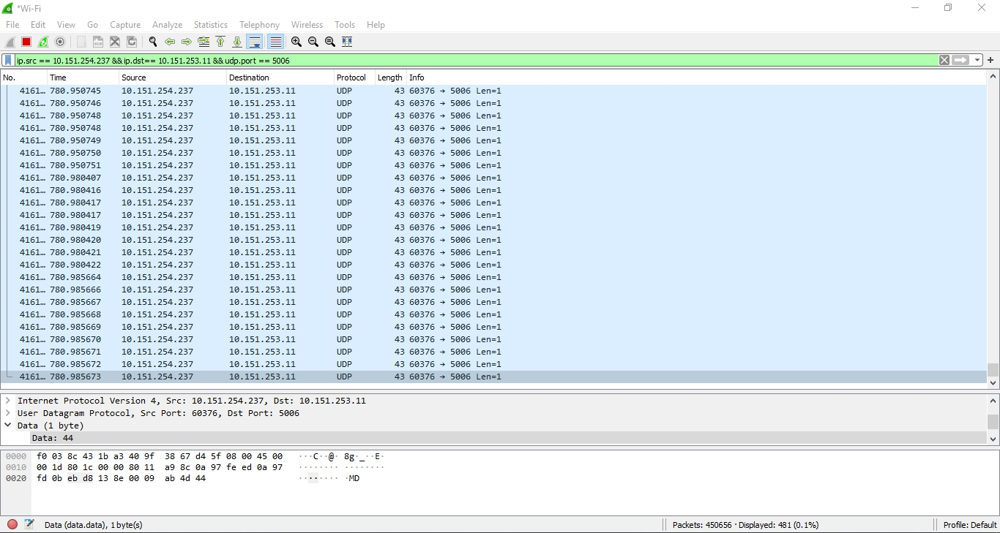

# Tugas 2
### Menjalankan udp_simple dari IP = 127.0.0.1 dengan port 5006
#### Pesan yang dikirimkan adalah "ABCDEFGHIJKLMNOPQRSTUV"

### Menjalankan udp_fileclient dari IP = 127.0.0.1 dengan port 5006
#### File yang dikirimkan adalah "bart.png

### Menjalankan udp_simple dari IP = 10.151.254.237 ke IP = 10.151.253.11 dengan port 5006
#### Pesan yang dikirimkan adalah "Andhika Yoga Perdana 05111740000101"

### Menjalankan udp_fileclient dari IP = 10.151.254.237 ke IP = 10.151.253.11 dengan port 5006
#### File yang dikirimkan adalah "bart.png

