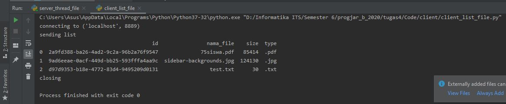

Andhika Yoga Perdana   05111740000101  

## Tugas 4
### Meletakkan File
* Bukti
    Saat client berjalan 
    
    
    

    Saat server berjalan 
    

    Hasilnya 
    

### Mengambil File 
* Bukti
    Saat client berjalan 
    
    
    

    Saat server berjalan 
    

    Hasilnya 
    
    

### Melihat List File
* Bukti
    Saat client berjalan 
    

    Saat server berjalan 
    

    Hasilnya 
    

### Ketentuan Membaca Format
* Format yang digunakan setiap request data adalah dalam bentuk JSON
* Default format json yang digunakan : json.dumps(dict(aksi="transfer", file=message, size=size, type=file_extension))
    
### Daftar Fitur + Langkah-langkah

* Meletakkan file dari client ke server
    * Request : "transfer"; response : OK (jika berhasil)
    * Komputer client dapat melihat file apa aja yang bisa dikirim ke server
    * Client dapat mengetikkan file apa yang akan disimpan di server
    * Buat data json yang berisi tentang perintah untuk meletakkan file, nama file, ukuran file dan tipe file lalu kirim data json dari client ke server 
    * Semua tipe ekstensi file dengan berbagai macam ukuran dapat dikirimkan ke server
    * Server menerima data json, langsung mengeksekusi sesuai dengan perintah
    * Ada pesan pemberitahuan jika file berhasil dikirimkan atau tidak
    * File yang dikirimkan ke server akan disimpan ke dalam server
    * Identitas file berupa random id, nama file, filesize, dan tipe ekstensi juga disimpan dalam file "mydatafile.dat" di server
    * Setiap proses yang terjadi pada server tercatat pada log
    
* Melihat list file di server dan menampilkannya pada client
    * Request : "list"; response : daftar file format json
    * Buat data json yang berisi tentang perintah untuk melihat daftar list
    * Client meminta data file apa saja yang tersimpan pada server dengan mengirimkan request json
    * Server menerima data json, langsung mengeksekusi sesuai dengan perintah
    * Server mengirimkan list file yang tersimpan ke client yang berformat JSON
    * client menampilkan list file menggunakan dataframe agar mudah dilihat
    * Setiap proses yang terjadi pada server tercatat pada log
    
* Mengambil file dari server ke client
    * Request : "get"; response : file yang dicari (format json) 
    * Client mengetikkan file apa yang ingin didapatkan
    * Client mengirimkan request berformat JSON tersebut ke server
    * Server menerima data json, langsung mengeksekusi sesuai dengan perintah
    * Server mengecek apakah file yang diinginkan terdapat pada database server
    * File akan dikirimkan ke client apabila file tersimpan pada database server. Jika file tidak tersimpan di database server maka file tidak akan dikirimkan
    * Client dapat mengetahui status pengirimkan file apakah berhasil atau tidak
    * Setiap proses yang terjadi pada server tercatat pada log
   
